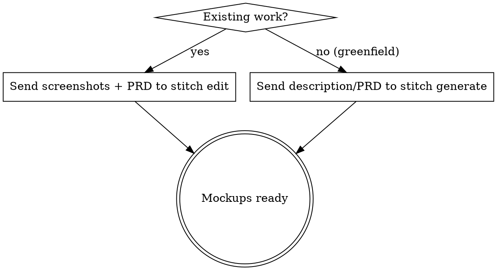
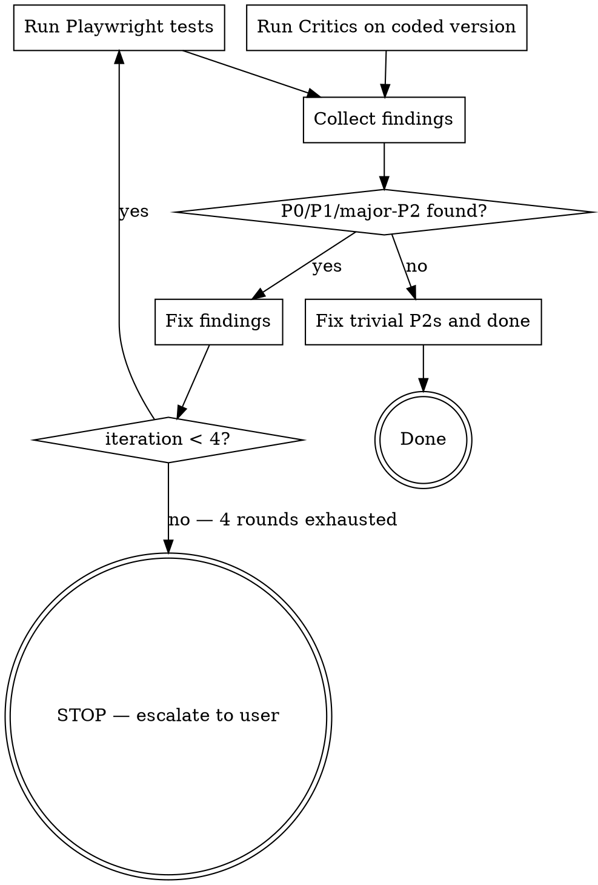

# UX Design Pipeline

Full design-and-build pipeline: wireframe → critique → revise → implement → test → fix loop.

Orchestrates 4 roles across 7 MCP servers:

| Role | MCP Servers | Job |
|------|------------|-----|
| Wireframer | stitch | Generate visual mockups from descriptions |
| Critics | ux-knowledge, ui-expert, ui-ux-pro | Review against heuristics, audience, patterns |
| Builder | magic (21st.dev) | Production components from validated mockups |
| Tester | playwright | Browser automation to verify flows |

## Phase 0: Preflight — Verify MCP Tools

**MUST run before any design work.** Check that required MCP servers are connected.

```
Required servers:
  - stitch (mcp__stitch__*)
  - ux-knowledge (mcp__ux-knowledge__*)
  - ui-expert (mcp__ui-expert__*)
  - ui-ux-pro (mcp__ui-ux-pro__*)
  - magic (mcp__magic__*)
  - playwright (mcp__plugin_playwright_playwright__*)
```

**Action:** List available MCP tools. For each required server, confirm at least one tool exists with that prefix.

- If ALL present → proceed
- If ANY missing → STOP. Tell the user which servers are missing and provide install commands:

```bash
# Wireframer
claude mcp add stitch --transport http https://stitch.googleapis.com/mcp --header "X-Goog-Api-Key: YOUR_API_KEY" -s user

# Critics
claude mcp add ux-knowledge -- npx @elsahafy/ux-mcp-server
claude mcp add ui-expert -- npx github:reallygood83/ui-expert-mcp
claude mcp add ui-ux-pro -- npx ui-ux-pro-mcp --stdio

# Builder
claude mcp add magic -- npx @21st-dev/magic-mcp

# Tester (Playwright MCP — already installed if plugin active)
# Verify: mcp__plugin_playwright_playwright__browser_navigate exists
```

## Phase 1: Requirements

Read the PRD, requirements.md, or user description. Extract:

1. **User flows** — what the user does on this screen
2. **Audience profile** — age, role, technical level, device, context (this feeds UI Expert)
3. **Constraints** — brand colors, existing design system, accessibility requirements

If no audience profile exists, ask the user before proceeding. The Critics need this.

## Phase 2: Wireframe (Stitch)



### Greenfield (no existing screens)
Use `/stitch-design` skill → `generate_screen_from_text` with enhanced prompt incorporating audience profile and design constraints.

### Existing work
Send existing screenshots along with the PRD to `/stitch-design` skill → `edit_screens` to refine.

**Output:** Mockup screenshots saved to `.stitch/designs/`. PAUSE — show mockups to user, wait for approval.

## Phase 3: Critique (Three Critics)

Run ALL THREE critics on the approved mockups. Each serves a different purpose:

### 3A — UX Knowledge (`mcp__ux-knowledge__*`)
- `review_usability` — Nielsen heuristic evaluation
- `check_contrast` — WCAG contrast compliance
- `analyze_accessibility` — Full accessibility audit
- `analyze_information_architecture` — Navigation and hierarchy

### 3B — UI Expert (`mcp__ui-expert__*`)
- `analyze_ui` — Audience-specific analysis (pass the audience profile from Phase 1)
- `create_component` — Generate design tokens for the target audience
- `improve_component` — Specific improvement recommendations

### 3C — UI-UX Pro (`mcp__ui-ux-pro__*`)
- `search_patterns` — Find validated patterns for the screen type
- `search_components` — Component-level pattern matches
- `search_platforms` — Platform-specific best practices

### Synthesize Findings

Collect all findings into a unified review with severity ratings:

| Severity | Definition | Action |
|----------|-----------|--------|
| P0 | Blocks usability (broken flow, inaccessible) | MUST fix |
| P1 | Significant UX issue (confusing hierarchy, wrong audience fit) | MUST fix |
| P2-major | Notable quality issue (inconsistent spacing, poor contrast) | SHOULD fix |
| P2-minor | Polish item (slight alignment, color tweak) | Fix if trivial |
| P3 | Subjective preference | Skip |

**Conflict resolution:** When critics disagree:

1. Usability over aesthetics
2. Audience-specific over generic
3. Accessibility requirements are non-negotiable

## Phase 4: Revise Mockups (Stitch again)

Apply all P0, P1, and P2-major findings from Phase 3. Use `/stitch-design` → `edit_screens` for targeted updates (not full regeneration unless layout is fundamentally wrong).

PAUSE — show revised mockups to user, wait for approval.

## Phase 5: Implement (Magic MCP)

Use Magic MCP (`mcp__magic__*`) to build production components:

1. `21st_magic_component_builder` — Generate components matching the approved mockups
2. `21st_magic_component_inspiration` — Find existing production components that match needed patterns
3. `21st_magic_component_refiner` — Polish generated components

Wire components into the application code. Replace mockup placeholders with real, functional UI.

PAUSE — show working application to user, wait for approval.

## Phase 6: Test and Fix Loop (Playwright + Critics)



### 6A — Playwright Browser Tests

Run in parallel with critic re-review:

```
browser_navigate → target URL
browser_snapshot → capture current state
browser_click → test interactive elements (buttons, links, tabs)
browser_fill_form → test form inputs
browser_console_messages → check for JS errors
browser_take_screenshot → capture final state
```

Test every user flow from Phase 1 requirements.

### 6B — Critics Re-Review

Run UX Knowledge + UI Expert on the coded version. Real components sometimes break spacing, hierarchy, or contrast from the mockup phase.

### 6C — Recursive Fix Loop

1. Collect all Playwright errors + Critic findings
2. Classify by severity (P0/P1/P2-major/P2-minor/P3)
3. If P0, P1, or major P2 items exist → fix them → re-run tests (back to 6A)
4. Maximum 4 iterations. If still failing after 4 rounds → STOP, report remaining issues to user
5. When only trivial P2 items remain → fix those → done

### Exit Criteria

Pipeline is complete when:

- All P0 and P1 findings resolved
- All major P2 findings resolved
- Playwright tests pass (no JS errors, all flows complete)
- Only trivial P2 or P3 items remain (fixed in final pass)

## PAUSE Points Summary

| After Phase | What to Show | Wait For |
|-------------|-------------|----------|
| Phase 2 (Wireframe) | Mockup screenshots | User approval to proceed to critique |
| Phase 4 (Revise) | Updated mockup screenshots | User approval to proceed to implementation |
| Phase 5 (Implement) | Working application | User approval to proceed to testing |

Phase 6 (Test/Fix) runs autonomously up to 4 iterations without pausing.

## Quick Reference

```
/qdesign "Activity dashboard for project managers, 35-55, laptop users"

Phase 0: Preflight    → verify 6 MCP servers connected
Phase 1: Requirements → extract flows, audience, constraints
Phase 2: Wireframe    → stitch mockups → PAUSE for approval
Phase 3: Critique     → 3 critics review → synthesize P0-P3
Phase 4: Revise       → stitch edit with fixes → PAUSE for approval
Phase 5: Implement    → magic MCP components → PAUSE for approval
Phase 6: Test/Fix     → playwright + critics → fix loop (≤4 rounds)
```
